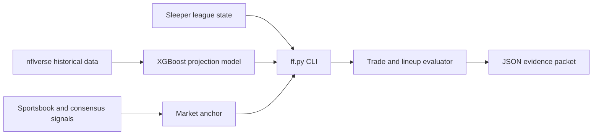

# Fantasy Football Advisor

A command-line decision engine for a 12-team PPR redraft league.
It combines live league state, point-in-time projections, and market signals so trade decisions can be audited instead of guessed.
Finished project: the forecasting and evaluation work is no longer maintained.

[](https://github.com/reeve25/FantasyFootball/actions/workflows/ci.yml)

## Highlights
- **Measured forecasting, not vibes.** A point-in-time XGBoost projection model scored on **25,903 player-weeks (2021–2025)**
  in exact league scoring, with walk-forward validation. Final pipeline MAE **4.71 fantasy points**. Features that didn't
  pay for themselves (implied team totals, matchup-opponent shrinkage: 4.7065 → 4.7078 MAE) were measured and removed.
  Report: [`docs/model_scorecard.json`](docs/model_scorecard.json).
- **Market anchoring.** Sportsbook lines are converted to projected points and blended with the model, with a guard against
  double-counting the same signal ([`docs/MARKET_ANCHOR.md`](docs/MARKET_ANCHOR.md)).
- **Trade evaluation.** Roster-aware trade search plus a replica of a third-party trade calculator, checked against the live service.
- **Tested.** 235 offline tests (runtime + integration), with backtest reports under [`docs/backtest/`](docs/backtest/).

## Stack
Python · XGBoost · pandas · polars · Sleeper API · nflverse (nflreadpy) · unittest

## Architecture



`ff.py` is the only public entry point. The model and market anchor remain separate inputs so the evaluator can report where a recommendation came from.

## Run in three commands

Set `league_id` and the numeric `my_roster_id` in `advisor_runtime/config.json`, then run from PowerShell:

```powershell
python -m venv .venv
.venv\Scripts\python -m pip install -r requirements.txt
.venv\Scripts\python ff.py packet "Kenneth Walker for Drake London?"
```

Add `--offline` to reuse a previously refreshed local snapshot without making network calls.

## Sample output

This is an excerpt from the model scorecard produced by `python ff.py model-scorecard`:

```json
{
  "status": "scored",
  "final_step": "5_consensus_ecr",
  "steps": {
    "1_trailing_average": {"n": 25903, "mae": 5.2023},
    "2_ffopportunity": {"n": 25903, "mae": 4.7721},
    "4_structural_usage": {"n": 25903, "mae": 4.7392},
    "5_consensus_ecr": {"n": 25903, "mae": 4.7101}
  }
}
```

The full checked-in result is [`docs/model_scorecard.json`](docs/model_scorecard.json).

## Design decisions

- Use walk-forward, point-in-time validation instead of a random split, and remove features that do not improve held-out error ([forecasting method](docs/FORECASTING.md)).
- Keep sportsbook-derived projections as a separate market anchor and guard against counting the same signal twice ([market anchor](docs/MARKET_ANCHOR.md)).
- Fail closed when evidence is stale, missing, or incomplete instead of turning missing data into a confident answer ([known traps](docs/TRAPS.md)).
- Keep one CLI entry point so live, offline, and test paths exercise the same decision engine.

## Tests

```bash
python -m unittest discover -s advisor_runtime/tests -t .
```

## Layout
| Path | What |
|---|---|
| `ff.py` | CLI entry point |
| `advisor_runtime/` | engine, projection sources, market anchor, trade search, backtest |
| `advisor_runtime/models/` | trained XGBoost artifacts + metadata |
| `docs/` | design notes: forecasting, assumptions, known traps, backtests |
| `AGENTS.md`, `CLAUDE.md`, `BRIEF.md` | instructions for the AI coding agents used to build and run it |

## What I'd do next

- Compare the public model blend against Sleeper and ESPN on the same player-weeks.
- Fit structural volume weights after enough current-season snaps and targets are available.
- Calibrate risk-aware decisions after several weeks of scored forecasts instead of guessing at confidence today.

Built with Claude Code and Codex as pair programmers; the agent instruction files are part of the repo on purpose.
